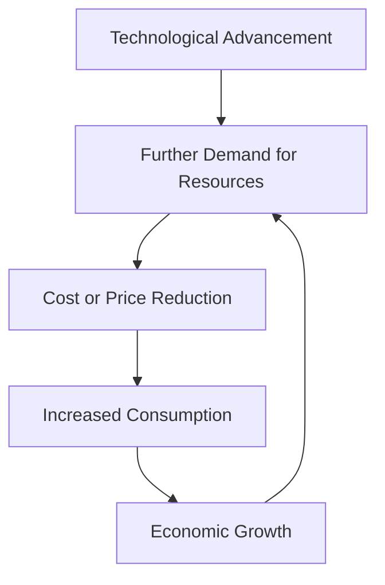

# LLM SATs FTW

Augmenting Analyst Descision Making with AI driven Structured Analytic Techniques

  
    Scott J Roberts - SANS Emerging Threat Summit 2025
  

---
layout: image-right
image: https://avatars.githubusercontent.com/u/44774?v=4
---

# Scott J Roberts

- Instructor of Cyber Security @ [Utah State University](https://www.usu.edu)
- Founder @ [Taurus.blue](https://taurus.blue)
- Author of Intelligence Driven Incident Response with Rebeakh Brown
- _Former_ SANS 578 Instructor

---
layout: section
---

# Threat, Problems, & Solutions

---
level: 2
layout: fact
---

# Threat: Cognitive Bias

## A systematic deviation from the truth based on **System 1** thinking.

---
level: 2
layout: quote
---

# "Structured analysis is a mechanism by which internal thought processes are externalized in a systemic and transparent manner so that they can be shared, built on, and easily critiqued by others."

~ Structred Analytic Techniques for Intelligence Analysis by Heuer & Pherson

---

# The Problem

SATs are hard to learn, hard to use, and hard to teach, take too long.

---
level: 2
layout: fact
---

# Analysts + SATs + LLMs == Profit??

---
layout: section
---

# Experiments

---
level: 2
---

# SAT #1 - Starbursting

---

# SAT: Starbursting

## "**Starbursting** is a brainstorming technique that focuses on generating questions rather than eliciting ideas or answers. It uses the six questions commonly asked by journalists: Who? What? How? When? Where? and Why?"

### ~ Structured Analytic Techniques for Intelligence Analysis by Heuer & Pherson

<!-- A Brainstorming technique -->

---
level: 2
---

# SAT #2 - Analysis of Competing Hypotheses (ACH)

---

# SAT: Analysis of Competing Hypotheses (ACH)

## "**Analysis of Competing Hypotheses (ACH)** is an analytic process that identifies a complete set of alternative hypotheses, systematically evaluates data that are consistent or inconsistent with each hypothesis, and proceeds by rejecting hypotheses rather than trying to confirm what appears to be the most likely hypotheses."

### ~ Structured Analytic Techniques for Intelligence Analysis by Heuer & Pherson

<!-- A Hypothesis Generation and Testing technique -->

---
level: 2
---

# SAT #3 - Key Assumptions Check

---

# SAT: Key Assumptions Check

## "The **Key Assumptions Check** is a systematic effort to make explit and question the assumptions (the mental model) that guide an analysts interpretation of evidence and reasoning about any particular problem."

### ~ Structured Analytic Techniques for Intelligence Analysis by Heuer & Pherson

<!-- An Assessment of Cause and Effect Technique-->

---
level: 2
---

# Results & Limitations

---
layout: section
---
# Conclusion

---
layout: two-cols-header
level: 2
---
# Jevon's Paradox

::left::

## "The Jevons Paradox is when making something work better actually leads to using more of it, not less."

### ~_PhilosophyTerms.com: Jevons Paradox_

::right::

<!-- Source: https://philosophyterms.com/jevons-paradox/ -->

---
level: 2
layout: fact
---

# AI
## Artificial Intelligence

---
level: 2
layout: fact
---

# IA
## Intelligence Augmentation

---

# Take Aways

- LLMs are not a replacement for Analysts
- Let computers do computer things, let humans do human things, and figure out they work together
- Experimentation is always better than theory
- An AI system doesn't have to be better than a human, just better than the best available human

---
layout: image
image: https://i.kym-cdn.com/entries/icons/original/000/053/522/vibe_vibe.jpg
background-size: contain
---

---

# Resources

---
layout: image-right
image: https://avatars.githubusercontent.com/u/44774?v=4
---

# Contact

- [sroberts.io](https://sroberts.io)
- [taurus.blue](https://taurus.blue)
- [LinkedIn: linkedin.com/in/scottroberts](https://www.linkedin.com/in/scottroberts/)

---
layout: end
---

# Thank You!!!
