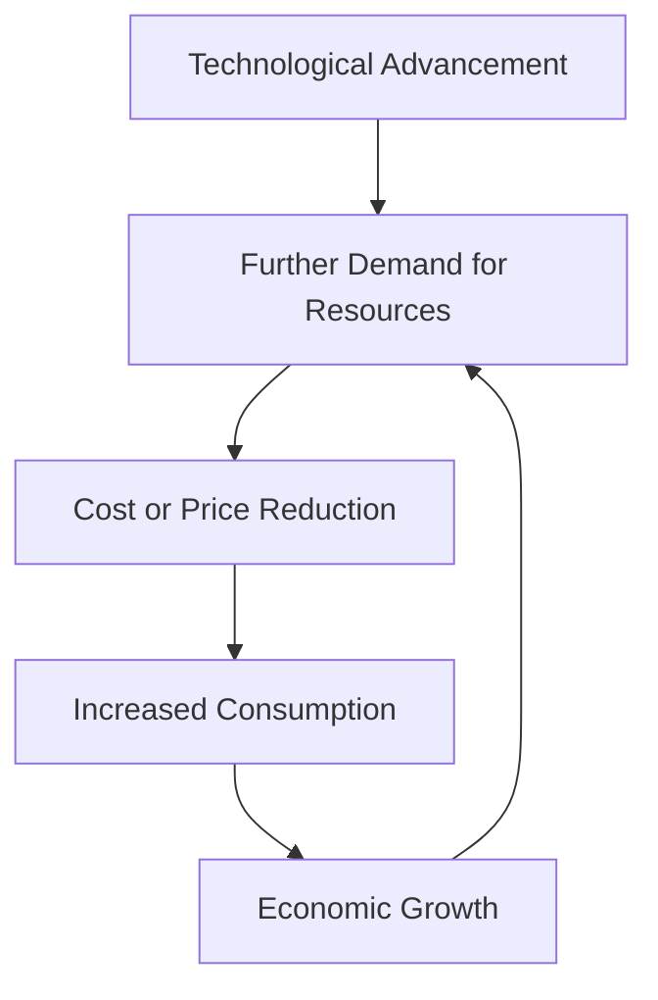

# LLM SATs FTW

Augmenting Analyst Descision Making with AI driven Structured Analytic Techniques

  
    Scott J Roberts - SANS Emerging Threat Summit 2025
  

---
layout: image-right
image: https://avatars.githubusercontent.com/u/44774?v=4
---

# Scott J Roberts

- Instructor of Cyber Security @ [Utah State University](https://www.usu.edu)
- Founder @ [Taurus.blue](https://taurus.blue)
- Author of Intelligence Driven Incident Response with Rebeakh Brown
- _Former_ SANS 578 Instructor

---
layout: section
---

# Threats, Problems, & Solutions

---
level: 2
layout: fact
---

# Threat #1: Boredom

---
level: 2
layout: fact
---

# Threat #2: Budget

---
level: 2
layout: fact
---

# Threat #3: Bias

---
level: 2
layout: quote
---

# "Structured analysis is a mechanism by which internal thgouht processes are externalized in a systemic and transparent manner so that they can be shared, built on, and easily cirquited by others." 

~ Structred Analytic Techniques for Intelligence Analysis by Heuer & Pherson

---

# The Problem

SATs are hard to learn, hard to use, and hard to teach, take too long.

---
level: 2
layout: fact
---

# Analysts + SATs + LLMs == Profit??

---
layout: section
---

# Experiments

---
level: 2
---

# SAT #1 - Starbursting

---

# Starbursting

"**Starbursting** is a brainstorming technique that focuses on generating questions rather than eliciting ideas or answers. It uses the six questions commonly asked by journalists: Who? What? How? When? Where? and Why?""

<!-- A Brainstorming technique -->

---
level: 2
---

# SAT #2 - Analysis of Competing Hypotheses (ACH)

---

# Analysis of Competing Hypotheses (ACH)
"**Analysis of Competing Hypotheses (ACH)** is an anlaytic process that identifies a complete set of alternative hypotheses, systematically evaluates data that are consistnt or incosistent with each hypothesis, and proceeds by rejecting hypothese rather than trying to confirm what appears to be the most likely hypotheses."

<!-- A Hypothesis Generation and Testing technique -->

---
level: 2
---

# SAT #3 - Key Assumptions Check

---

# Key Assumptions Check
""

<!-- An Assessment of Cause and Effect Technqiue-->

---
level: 2
---

# Results & Limitations

---
layout: section
---
# Conclusion

---
align: center
level: 2
---
# Jevon's Paradox

---
level: 2
layout: fact
---

# AI
## Artificial Intelligence

---
level: 2
layout: fact
---

# IA
## Intelligence Augmentation

---

# Resources

---
layout: full
---

# Contact

- [sroberts.io](https://sroberts.io)

---
layout: end
---

# Thank You
