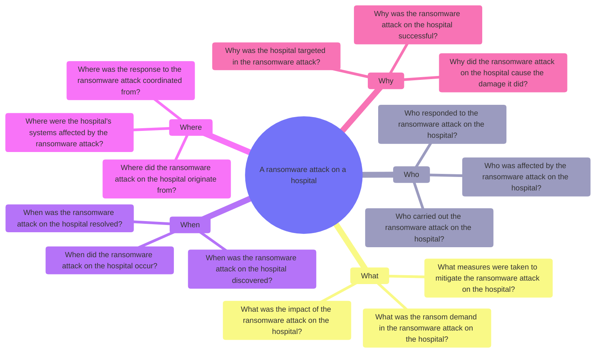
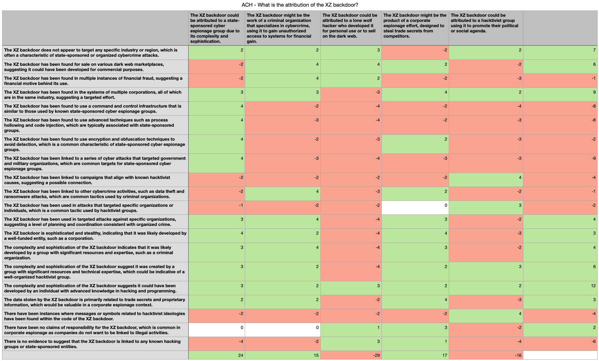
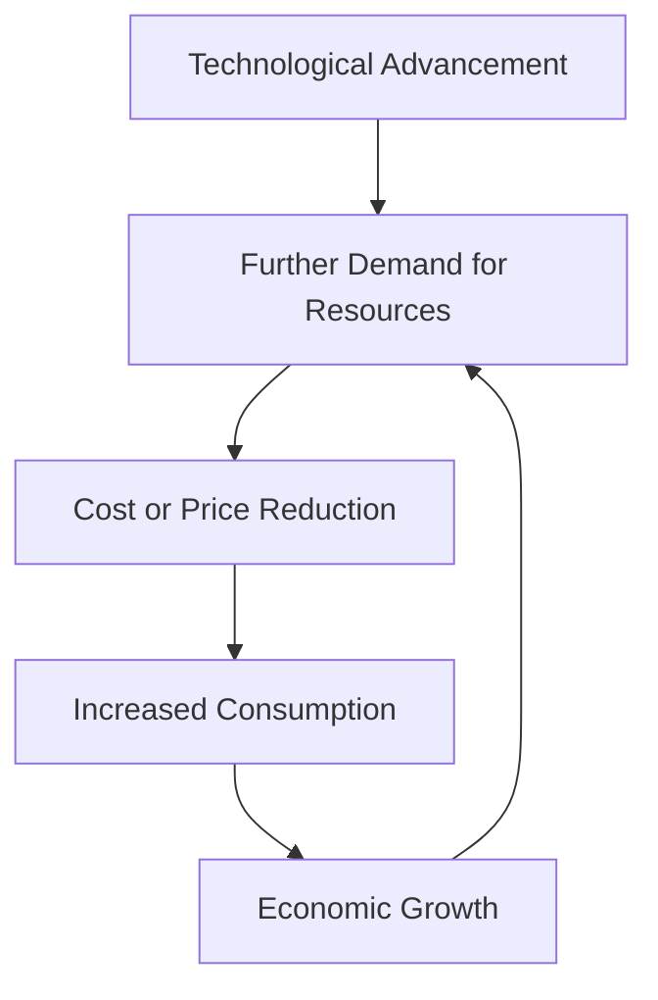

# LLM SATs FTW

Augmenting Analyst Decision Making with AI driven Structured Analytic Techniques

<div class="absolute bottom-10">
  <span class="font-600">
    Scott J Roberts - SANS Emerging Threat Summit 2025
  </span>
</div>

---
layout: image-right
image: https://avatars.githubusercontent.com/u/44774?v=4
---

# Scott J Roberts

- Instructor of Cyber Security<br>@ [Utah State University](https://www.usu.edu)
- Founder @ [Taurus.blue](https://taurus.blue)
- Author of Intelligence Driven Incident Response with Rebeakh Brown
- _Former_ SANS 578 Instructor

---
layout: section
---

# Threat, Problems, & Solutions

---
level: 2
layout: fact
---

# Threat:<br>Cognitive Bias

## A systematic deviation from the truth based on **System 1** thinking.

---
level: 2
layout: quote
---

# "Structured analysis is a mechanism by which internal thought processes are externalized in a systemic and transparent manner so that they can be shared, built on, and easily critiqued by others."

~ Structured Analytic Techniques for Intelligence Analysis by Heuer & Pherson

---

# The Problem

# SATs are hard to learn, hard to use, hard to teach, work best in teams, and take too long to execute effectively.


---
level: 2
layout: fact
---

# Analysts + SATs + LLMs == Profit??

---
layout: section
---

# Experiments


---

# SAT: Starbursting

## "**Starbursting** is a brainstorming technique that focuses on generating questions rather than eliciting ideas or answers. It uses the six questions commonly asked by journalists: Who? What? How? When? Where? and Why?"

### ~ Structured Analytic Techniques for Intelligence Analysis by Heuer & Pherson

<!-- A Brainstorming technique -->

---
title: Starbursting
---

# Starbursting

- Built a Streamlit app to run the Starbursting SAT
- Zero shot based on the SAT
    - Given a scenario, generate questions for who, what, when, where, why, and how
- Output a JSON file with the results for human review
- **Test Case:** A ransomware attack on a hospital

---
title: Starbursting Screenshot 1
layout: image
image: images/starburst_1.png
---

---
title: Starbursting Screenshot 2
layout: image
image: images/starburst_2.png
---
 
---
title: Starbursting JSON
level: 2
---

```json
{
  "topic": "A ransomware attack on a hospital",
  "answer_who": [
    "Who carried out the ransomware attack on the hospital?",
    "Who was affected by the ransomware attack on the hospital?",
    "Who responded to the ransomware attack on the hospital?"
  ],
  "answer_what": [
    "What was the impact of the ransomware attack on the hospital?",
    "What measures were taken to mitigate the ransomware attack on the hospital?",
    "What was the ransom demand in the ransomware attack on the hospital?"
  ],
  "answer_when": [
    "When did the ransomware attack on the hospital occur?",
    "When was the ransomware attack on the hospital discovered?",
    "When was the ransomware attack on the hospital resolved?"
  ],
  "answer_where": [
    "Where did the ransomware attack on the hospital originate from?",
    "Where were the hospital's systems affected by the ransomware attack?",
    "Where was the response to the ransomware attack coordinated from?"
  ],
  "answer_why": [
    "Why was the hospital targeted in the ransomware attack?",
    "Why was the ransomware attack on the hospital successful?",
    "Why did the ransomware attack on the hospital cause the damage it did?"
  ]
}
```

---
level: 2
---
# Starbursting Visual Output



---

# SAT: Analysis of Competing Hypotheses (ACH)

## "**Analysis of Competing Hypotheses (ACH)** is an analytic process that identifies a complete set of alternative hypotheses, systematically evaluates data that are consistent or inconsistent with each hypothesis, and proceeds by rejecting hypotheses rather than trying to confirm what appears to be the most likely hypotheses."

### ~ Structured Analytic Techniques for Intelligence Analysis by Heuer & Pherson

<!-- A Hypothesis Generation and Testing technique -->

---
title: ACH
---

# Analysis of Competing Hypotheses

- Built a Streamlit app to run the ACH SAT
- Multi stage process based on the SAT
    - Accepts a complex question
    - First API Call: Generate a list of hypotheses
    - Second Set of API Calls: Generate a list of evidence for/against each hypothesis
    - Third Set of API Calls: Score each hypothesis based on the evidence
- Ouput a CSV file with the results for human review
- **Test Case:** Who was behind the XZ backdoor?

---
title: ACH Screenshot 1
layout: image
image: images/ach_1.png
level: 2
---

---
title: ACH Screenshot 2
layout: image
image: images/ach_2.png
level: 2
---

---
title: ACH Screenshot 3
layout: image
image: images/ach_3.png
level: 2
---

---
title: ACH Output
level: 2
---



---

# SAT #3 - Key Assumptions Check

---

# SAT: Key Assumptions Check

## "The **Key Assumptions Check** is a systematic effort to make explit and question the assumptions (the mental model) that guide an analysts interpretation of evidence and reasoning about any particular problem."

### ~ Structured Analytic Techniques for Intelligence Analysis by Heuer & Pherson

<!-- An Assessment of Cause and Effect Technique-->

---
layout: image-right
image: images/strider.png
---
# Key Assumptions Check

- Built a Streamlit app to run the Key Assumptions Check SAT
    - Accepts a PDF file, extracts text
    - Zero-shot classification of the text
    - Generates a list of key assumptions
- **Test Case:** [Strider Technologies - Inside the Shadow Network](https://content.striderintel.com/wp-content/uploads/2025/05/Strider-Inside-Shadow-Network-Report.pdf)
    - The report is about North Korean IT workers and their involvement in cybercrime

---
title: Key Assumptions Check Screenshot 1
layout: image
image: images/kac_1.png
---

---
title: Key Assumptions Check Screenshot 2
layout: image
image: images/kac_2.png
---

---

# Key Assumptions Check

- The document assumes that IT workers are involved in the manipulation of cryptocurrency markets, including the use of malware to mine cryptocurrencies.
- The document assumes that North Korean IT workers are dispatched abroad to countries like the PRC, Russia, Southeast Asia, Africa, and the Middle East.
- The document assumes that North Korean IT workers are involved in cybercrime activities such as hacking, ransomware deployment, and intellectual property theft.
- The document assumes that North Korean IT workers are using false identities and front companies to infiltrate Western businesses.
- The document assumes that PRC-based entities are involved in shipping equipment for DPRK remote workers.
- The document assumes that PRC-based front companies are facilitating the global operations of fraudulent North Korean IT workers.

[...]

---
level: 2
layout: fact
---

# Results & Limitations

## Well it depends...

---
layout: section
---
# Conclusion

---
layout: two-cols-header
level: 2
---
# Jevon's Paradox

::left::

## "The Jevons Paradox is when making something work better actually leads to using more of it, not less."

### ~_PhilosophyTerms.com: Jevons Paradox_

::right::



<!-- Source: https://philosophyterms.com/jevons-paradox/ -->

---
level: 2
layout: fact
---

# AI → IA
## Artificial Intelligence to Intelligence Augmentation


---

# Take Aways

- LLMs are not a replacement for Analysts
- Let computers do computer things, let humans do human things, and figure out they work together
- Experimentation is always better than theory
- An AI system doesn't have to be better than a human, just better than the best available human

---
title: Vibe Check
layout: image
image: https://i.kym-cdn.com/entries/icons/original/000/053/522/vibe_vibe.jpg
---

---
layout: image-right
image: https://avatars.githubusercontent.com/u/44774?v=4
---

# Contact

- [sroberts.io](https://sroberts.io)
- [taurus.blue](https://taurus.blue) & [usu.edu](https://www.usu.edu)
- [linkedin.com/in/scottroberts](https://www.linkedin.com/in/scottroberts/)
- [github.com/sroberts/talk-llm-sats-ftw-code](https://github.com/sroberts/talk-llm-sats-ftw-code)

---
layout: end
---

# Thank You!!!
